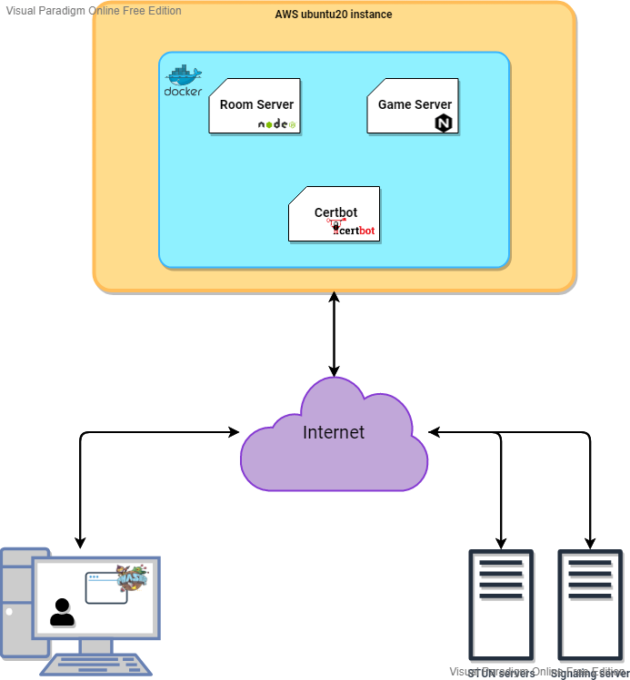
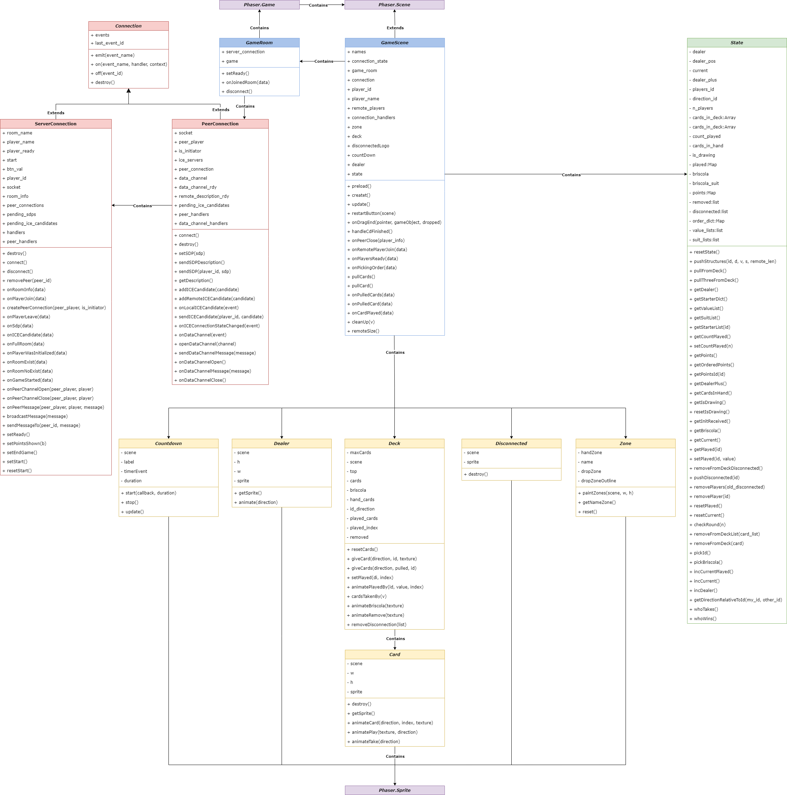

# Distributed briscola

The project is an attempt to create a multiplayer (Max 4 players) italian card game called briscola. 
The structure is made of two main components, the server that handles the Room and the WebRTC communication between the peers for the information exchange during the game. 

## Home Page

In the home page you can create a new room


Or you can join an existing room.


## Game Room

When creating a new room the game keeps you waiting for other players to join, while all the assets needed are added to the screen


After another player joins the game can start, also it's indicated how many players are in the room (MAX 4)


Then the game starts 


## In game

Here i should add gifs or something that makes it easy to understand how the game goes on

## How to run

The game is born as a university project, so it's not thought as an easy to run project for all the users.
Make sure to have NodeJS and npm installed.
### Running locally


If the game is to be run in a local network then just clone the repository and open a new terminal.
```
|> chmod +x run_local.sh
|> ./run_local.sh
|> npm install
|> npm run game_server
```

In the second terminal:

```
npm run room_server
```

Going to localhost:8080 will make you reach the game.

### Running in Docker
This is actually my preferred choice because everything is automated, the only thing that needs to be done is to have Docker and Docker Compose installed.
If these requirements aren't met then check out [this](https://docs.docker.com/compose/install/) link.

Now you can deploy the game:

```
|> chmod +x run_local.sh
|> chmod +x run_docker.sh
|> ./run_local.sh
|> ./run_docker.sh
```

If the container is deplyed locally the game will be accessible at `https://localhost`

### Docker on aws
If you want to access your game from everywhere you can instantiate an ubuntu (or another linux distro) server somewhere (like AWS), deploy your container there using the above instructions and then access the game remotely by using the public IP that your server exposes. 

## Implementation

### Repo Structure
- `game_folder` - Game source code
	- `game_files` - game code
		- `game` - game field code
			- `images` - game assets such as sprites and textures
			- `scripts` - game field scripts
				- `connections` - game networking scripts
				- `game_objects` - game classes
				- `logic` - implementation of the logic for the game
				- `game_config.js`
				- `main.js`
			- `styles` - game field css styles
			- `index.html` - game field page
		- `images` - images for the room creation page
		- `libs` - min.js versions of required libraries that had to be downloaded
		- `scripts` - room creation page scripts
		- `styles` - room creation page css styles
		- `404.html` - 404 page
		- `index.html` - room creation page
    - `Dockerfile` - instructions to build the Docker image
	- `nginx.conf` - config of the nginx static server
- `room_server` - Room Server source code
- `docker-compose.yml` - Docker compose with Game Server, Room Server, and Certbot services
- `get_certificates.sh` - script to receive Let's Encrypt TLS certificates
- `package.json` - npm package description
- `run_local.sh` - script to update configs to run the game locally
- `run_docker.sh` - script to update configs to run the game with Docker

### Structure approximation


### Class diagram
