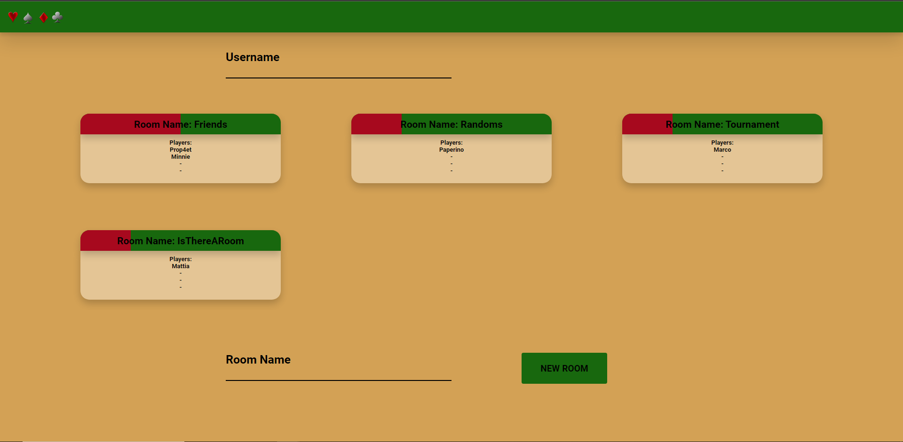
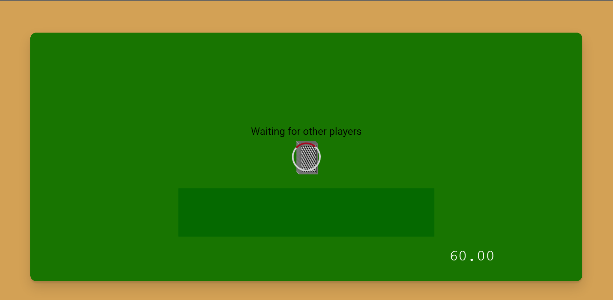
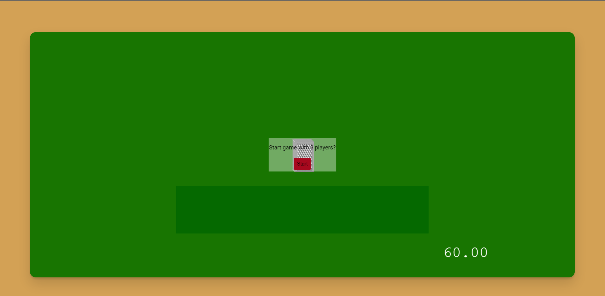
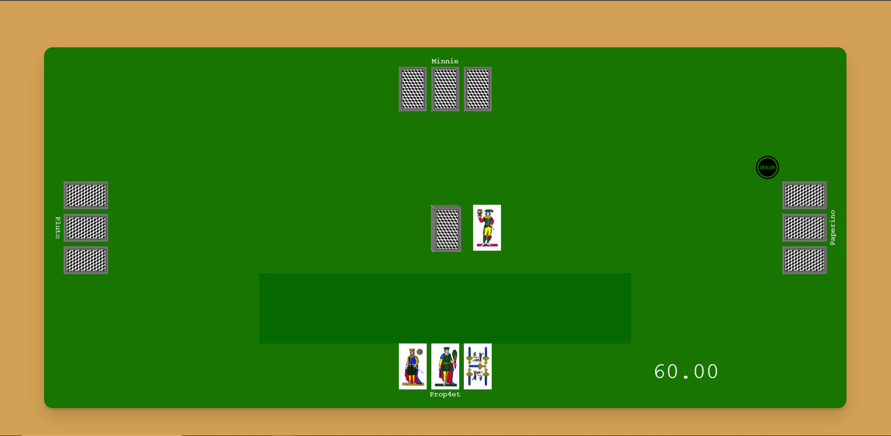

# Distributed briscola
The project is an attempt to create a multiplayer (Max 4 players) italian card game called briscola. 
The structure is made of two main components, the server that handles the Room and the WebRTC communication between the peers for the information exchange during the game. 

## Home Page
In the home page you can create a new room

Or you can join an existing room.

## Game Room
When creating a new room the game keeps you waiting for other players to join, while all the assets needed are added to the screen

After another player joins the game can start, also it's indicated how many players are in the room (MAX 4)

Then the game starts 
